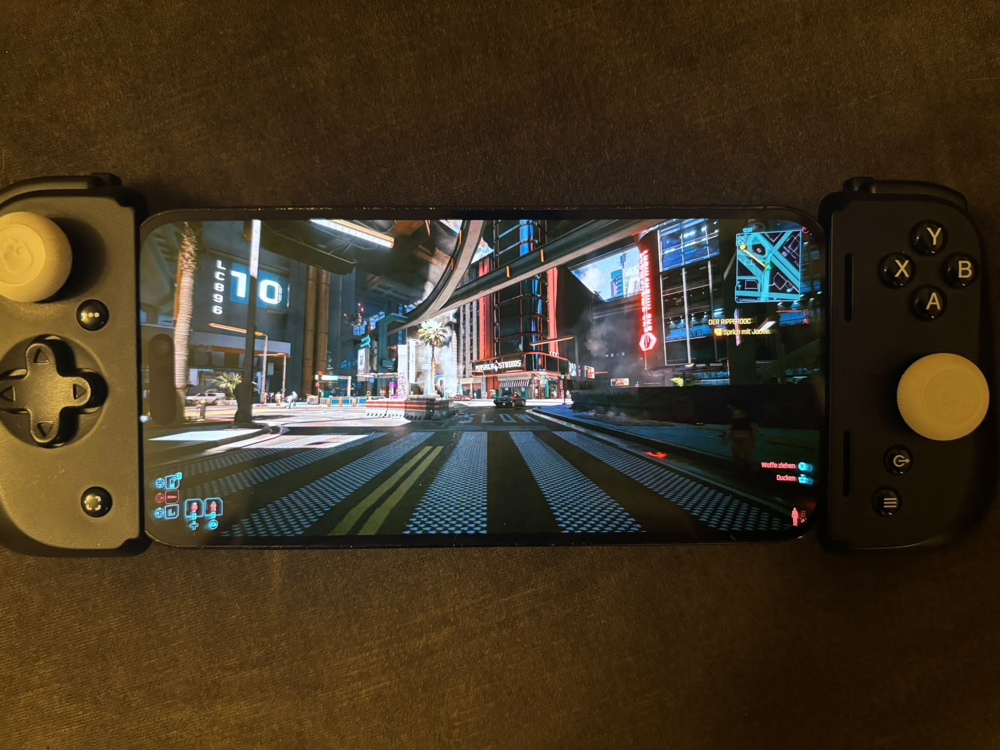

# Hermes — fork with experimental NVIDIA (NVENC) support

> **This is a fork of [MrOz59/Hermes](https://github.com/MrOz59/Hermes).**
> It adds working NVIDIA/NVENC support for Hermes-KMS virtual displays plus
> dynamic per-client mode switching on KDE Wayland. The goal is to get these
> changes upstreamed; until then this fork exists so NVIDIA users can test.



*Cyberpunk 2077, streamed by this fork from a Linux host (KDE Wayland,
RTX 5060 Ti, NVENC) to Moonlight on an iPhone running at its native
2796x1290 — the virtual display adopts the client's exact mode.*

## Credits

- **[Teodor Gross](https://github.com/teodorgross)** — project lead of this
  fork: initiative, test hardware, on-device verification (iPhone/Moonlight,
  Cyberpunk 2077) and the debugging sessions on the only machine this has
  ever run on.
- **Claude (Anthropic)** — AI pair-engineering: NVENC enablement, capture
  path, mode-switch logic and the diagnostic tooling, driven and validated
  by Teodor.
- **[MrOz59](https://github.com/MrOz59)** — Hermes and the Hermes-KMS
  virtual display driver this fork builds on.
- **[ClassicOldSong](https://github.com/ClassicOldSong/Apollo)** — Apollo
  and Artemis, the origin of the per-client virtual display concept.
- **[LizardByte](https://github.com/LizardByte/Sunshine)** — Sunshine, the
  streaming host everything here descends from.
- **[Moonlight](https://moonlight-stream.org/)** — the client ecosystem
  used for every test in this fork.
- **[Nobara Linux](https://nobaraproject.org/)** — the operating system all
  of this was developed and tested on (Nobara 44, KDE Plasma).
- **KDE/KWin** — the compositor driving the virtual display, controlled via
  `kscreen-doctor`.

## ⚠️ Test status — read before using

- **Tested hardware: a single machine.** GeForce RTX 5060 Ti (Blackwell,
  50 series), proprietary driver 595.84, CUDA 13.2, Nobara 44
  (Fedora-based), KDE Plasma 6 Wayland, kernel 7.1.4. **No other GPU
  generation (40/30/20 series...) has been tested.** It should work on
  anything the driver's CUDA/NVENC stack supports, but that is an
  expectation, not a promise.
- Verified end to end with Moonlight (desktop) and Moonlight iOS on an
  iPhone at its native 2796x1290@120 — the virtual display adopts each
  client's exact resolution **and** refresh rate on launch and on resume.
- Measured host frame processing latency at 2796x1290: **~3-5 ms average**.
- Mode switching is currently **KDE Wayland only** (it drives
  `kscreen-doctor`). GNOME/wlroots still enable the output but will not
  switch modes per client.

## What this fork changes (technical)

1. **NVENC enabled for Hermes-KMS virtual displays** (`kmsgrab.cpp`):
   upstream restricted the capture path to VAAPI; the CUDA/NVENC branch now
   exists end to end (`h264_nvenc`, `hevc_nvenc`, `av1_nvenc` all validate).
2. **Correct frames on NVIDIA via a CPU-copy capture path**
   (`display_hermes_ram_t`): NVIDIA's EGL import of the driver's
   system-memory DMA-BUFs reads the wrong pages past the first ~2 MB
   (diagonal-stripe corruption; the CPU view of the same buffer is
   pixel-perfect — reproducible with the diagnostic tools shipped in the
   [Hermes-KMS fork](https://github.com/teodorgross/Hermes-KMS)). NVENC
   sessions therefore mmap the DMA-BUF, de-pad rows on the CPU and feed the
   regular RAM→CUDA upload. Measured cost: the *average latency dropped*
   versus the (corrupt) zero-copy import path. VAAPI keeps true zero-copy.
3. **EGLImage bind fallback** (`graphics.cpp`): NVIDIA's desktop-GL driver
   rejects `glEGLImageTargetTexture2DOES` for foreign DMA-BUF imports with
   `GL_INVALID_OPERATION`; the import now falls back to
   `glEGLImageTargetTexStorageEXT` (`GL_EXT_EGL_image_storage`).
4. **Dynamic per-client mode** (`virtual_display.cpp`, `nvhttp.cpp`): a
   compositor keeps the current mode of an already-connected output, so the
   client's exact `WxH@Hz` is now applied through `kscreen-doctor` (with
   retry/verification) on session creation, on `changeDisplaySettings`, and
   on `/resume` when no other client is streaming.
5. **Crash and bootstrap fixes** (`misc.cpp`, `graphics.cpp`,
   `process.cpp`): lazy EGL loading instead of calling NULL glad pointers
   when platform init failed; `verify_kms()` accepts the Hermes-KMS
   render-node path so no `CAP_SYS_ADMIN` is needed for virtual-display
   capture; `map_display_name()` returning `""` on Linux no longer wipes
   `output_name` at session start (this broke *every* session with 503).
6. **Build fixes for distro CUDA toolkits** (`cmake`): `--cudart=shared`
   (Fedora's negativo17 packages ship no `libcudart_static`) and
   `/usr/include` marked implicit for nvcc so GCC's `include_next` chain
   survives.

Known issues in this fork:

- NVIDIA zero-copy (EGL import of the Hermes DMA-BUF) stays disabled for
  NVENC until the underlying import problem is fixed (driver- or
  NVIDIA-side); diagnostics live in the Hermes-KMS fork under
  `tools/hermes-egl-import-check/`.
- A hard-killed client keeps its RTSP session alive until the ping timeout;
  the next client only gets its own mode once that session is gone.
- HDR/P010 untested (upstream roadmap item).

## Quick start on Fedora-based systems (as tested)

```bash
# build deps (Fedora 44 / Nobara 44; negativo17 CUDA packages)
sudo dnf install cmake ninja-build gcc gcc-c++ git wget npm boost-devel \
  libcap-devel libcurl-devel libdrm-devel libevdev-devel libva-devel \
  libX11-devel libxcb-devel libXcursor-devel libXfixes-devel libXi-devel \
  libXinerama-devel libXrandr-devel libXtst-devel mesa-libGL-devel \
  mesa-libEGL-devel mesa-libgbm-devel miniupnpc-devel numactl-devel \
  openssl-devel opus-devel pulseaudio-libs-devel qt6-qtbase-devel \
  qt6-qtsvg-devel wayland-devel wayland-protocols-devel \
  cuda-nvcc cuda-cudart-devel cuda-gcc

# the kernel module — NOT bundled with the release (a kernel module must be
# built against your exact running kernel). DKMS does that automatically and
# rebuilds it on every kernel update; you need `dkms` + kernel headers
# (Fedora: kernel-devel; Debian/Ubuntu: linux-headers-$(uname -r)).
git clone https://github.com/teodorgross/Hermes-KMS.git
cd Hermes-KMS
sudo make dkms-install
sudo modprobe hermes_kms initial_enabled=0
# load it on every boot:
sudo install -Dm644 packaging/modules-load.d/hermes-kms.conf /etc/modules-load.d/hermes-kms.conf
printf '%s\n' 'options hermes_kms initial_enabled=0' | sudo tee /etc/modprobe.d/hermes-kms.conf
cd ..

# Hermes itself
git clone https://github.com/teodorgross/Hermes.git
cd Hermes
cmake -B build -G Ninja -DCMAKE_BUILD_TYPE=Release \
  -DSUNSHINE_ENABLE_CUDA=ON \
  -DCMAKE_CUDA_COMPILER=/usr/bin/nvcc \
  -DCMAKE_CUDA_HOST_COMPILER=/usr/bin/g++-15 \
  -DCMAKE_CUDA_FLAGS="--cudart=shared"
ninja -C build
```

Minimal `~/.config/hermes/hermes.conf` for NVIDIA:

```
virtual_display_backend = hermes_kms
capture = kms
encoder = nvenc
output_name = HERMES-1
```

Give the app you stream (e.g. a "Virtual Desktop" entry) the
`"virtual-display": true` flag in `apps.json` — the display then appears on
client connect with the client's mode and disappears on disconnect. No
`setcap`/root is needed for the capture itself.

---

*Original upstream README below.*

# Hermes

Hermes is an Apollo-derived Linux game-streaming host focused on making
Moonlight/Hestia streaming less manual and more reliable on CachyOS/Arch,
with low-latency real virtual displays through Hermes-KMS.

Hermes-KMS is a purpose-built DRM/KMS virtual display driver that streams the
compositor's scanout straight into the hardware encoder as a DMA-BUF, with no
CPU readback. It is the default backend because it avoids the GPU→RAM→GPU copy
that EVDI does, which lowers latency. EVDI is still fully supported and can be
selected at any time — both backends work. (Measured capture cost on KWin at
720p: ~8 us/frame on Hermes-KMS vs ~180 us/frame for EVDI's CPU copy, and
constant regardless of resolution.)

Hermes keeps protocol compatibility with Sunshine, Moonlight, Artemis, and
Hestia. The normal GameStream/Sunshine flow remains the fallback path, while
Hestia can use Hermes protocol extensions when the host reports support for
them. The product is branded Hermes throughout the UI, but the protocol lineage
identifier stays `Apollo` so existing Artemis/Hestia clients keep working
unchanged.

## Current focus

- Create and activate a real virtual display. Hermes-KMS is the default for
  its lower latency; EVDI is a fully supported alternative and the automatic
  choice where Hermes-KMS is unavailable.
- Use KDE/KScreen or Wayland output-management integration to make the
  compositor actually render into the virtual display.
- Avoid falling back silently to the physical monitor when virtual-display
  setup fails.
- Report missing host dependencies and diagnostics clearly.
- Keep Gamescope optional. Gamescope is useful for a SteamOS-like session, but
  Hermes should only use it when enabled by app configuration, settings, or an
  explicit Hestia request.

## Hestia protocol support

Hermes exposes Hestia protocol v1 endpoints under:

```http
/api/hestia/v1
```

Important endpoints include:

- `GET /api/hestia/v1/capabilities`
- `POST /api/hestia/v1/session/prepare`
- `POST /api/hestia/v1/session/stop`
- `GET /api/hestia/v1/diagnostics`
- `GET /api/hestia/v1/clipboard`
- `POST /api/hestia/v1/clipboard`

Clients should gate enhanced behavior on the capabilities response. If the
Hestia API is unavailable, clients should continue through the normal
Moonlight/Sunshine flow.

## Clients

- **Android:** Artemis (ClassicOldSong's Moonlight fork) — the reference client.
- **Desktop:** Hestia — <https://github.com/MrOz59/Hestia>. No binary release
  yet; build from source. Hestia is the client tuned to Hermes' protocol
  extensions; generic Moonlight clients also work through the standard flow.

The web UI (`https://<host>:47990`) is branded Hermes. Set the displayed server
name under *Configuration → General → Server Name*; it defaults to the PC's
hostname.

## Virtual display behavior

Hermes tries to create and connect a virtual display for virtual-display
sessions before launching the configured app, selected by the
`virtual_display_backend` setting (`hermes_kms` or `evdi`).

### Hermes-KMS (preferred, zero-copy)

The compositor owns the virtual card and scans out the desktop; Hermes opens the
Hermes-KMS render node and pulls each frame as a DMA-BUF, which a real GPU
imports and encodes. On Linux/KDE Wayland this depends on:

- the `hermes_kms` kernel module loaded with `initial_enabled=0`, leaving its
  connector disconnected until Hermes owns it for a stream, and its card left
  on the active seat;
- `kscreen-doctor` (KWin) or a Wayland output-management protocol to enable the
  virtual output;
- a real GPU render node (e.g. amdgpu) for VAAPI encoding;
- a session where the Hermes process can access the user compositor environment.

The unreleased branch has two distinct opt-in experiments:

- `hermes_kms_multi_output = true` gives simultaneous clients separate outputs
  and capture pipelines, but those outputs still belong to the same host
  desktop/compositor session. It requires Hermes-KMS UAPI 8 or newer, loaded
  with enough outputs:

```bash
sudo modprobe hermes_kms initial_enabled=0 outputs=2
```

- `hermes_kms_isolated_sessions = true` is the new independent-session
  prototype. One Hermes server starts a separate compositor, application
  process tree, capture path, and tagged virtual input set for each client.
  Application profiles run directly in a DRM Gamescope session; desktop
  profiles run Weston with its desktop shell and panel. It requires the
  development Hermes-KMS UAPI 9 driver with one independent DRM card per
  client:

```bash
sudo modprobe hermes_kms initial_enabled=0 devices=2 outputs=1
```

The isolated prototype also requires the driver's session-seat udev rule,
`gamescope`, `weston`, and one private seat broker per device. For the
two-device example, install `seatd`, add the Hermes user to the `seat` group,
and start:

```bash
sudo systemctl enable --now hermes-kms-seatd@1.service hermes-kms-seatd@2.service
```

Hermes selects `/run/hermes-kms-seatd/N/seatd.sock` for device `N`; it will
reject an isolated launch with an actionable log message if that broker is not
available. The brokers are experimental process/session plumbing, not a
security boundary for mutually untrusted local users. Per-session audio, a
full Plasma desktop, and real concurrent Moonlight clients have not been
validated yet. Both experiments default to off; the existing single-output
path remains the default. If both experimental flags are present,
`hermes_kms_isolated_sessions` takes precedence and shared-desktop
multi-output management stays inactive.

The input-only/Remote Input application is intentionally unavailable in this
mode because it has no compositor session that identifies which private seat
should receive its events.

The repository includes `scripts/vm-isolated-input-test.sh`, which uses a
disposable virtme-ng guest to create two real uinput keyboards and verify that
the packaged udev rules assign them to `hermes-kms-1` and `hermes-kms-2`
without modifying host rules.

#### Installing the Hermes-KMS driver

Hermes-KMS is an out-of-tree kernel module distributed via DKMS, so it rebuilds
automatically for every kernel update (the same way `evdi-dkms` works). The
source lives at <https://github.com/MrOz59/Hermes-KMS>.

**Option A — DKMS from a clone** (any distro with `dkms` and kernel headers):

```bash
git clone https://github.com/MrOz59/Hermes-KMS.git
cd Hermes-KMS
sudo make dkms-install        # registers + builds + installs via DKMS
sudo modprobe hermes_kms initial_enabled=0
```

The build auto-detects whether your kernel was built with clang (e.g. CachyOS)
or gcc, so no extra flags are needed. To load it automatically on every boot,
install the module-load drop-in and keep the connector initially disconnected:

```bash
sudo install -Dm644 packaging/modules-load.d/hermes-kms.conf /etc/modules-load.d/hermes-kms.conf
printf '%s\n' 'options hermes_kms initial_enabled=0' | sudo tee /etc/modprobe.d/hermes-kms.conf
```

To remove it:

```bash
sudo make dkms-uninstall
```

**Option B — Arch/CachyOS package** (builds and installs via DKMS, with boot
auto-load drop-ins included):

```bash
git clone https://github.com/MrOz59/Hermes-KMS.git
cd Hermes-KMS
makepkg -si
```

Older Hermes-KMS packages wrote `initial_enabled=1` to
`/etc/modprobe.d/hermes-kms.conf`. Change that option to `0` before rebooting;
Hermes also disconnects this legacy unowned output at startup so an upgrade can
recover without requiring the old package to be removed first.

Verify the module is loaded and a Hermes render node exists:

```bash
lsmod | grep hermes_kms
ls /dev/dri/by-path/ | grep hermes   # expect platform-hermes-kms-render -> ../renderD*
```

Do **not** install the driver's development seat-ignore udev rule for normal
streaming — it stops KWin/GNOME from adopting the output. That rule is only for
isolated `modetest` driver testing. See the driver repository for build internals
and the zero-copy validation tooling.

### EVDI (supported alternative)

EVDI remains a fully supported backend — set `virtual_display_backend = evdi`
to use it, or Hermes selects it automatically when Hermes-KMS is unavailable. It
depends on:

- `evdi` / `evdi-dkms`
- `libevdi`
- `kscreen-doctor`
- a session where the Hermes process can access the user compositor environment

`evdi` is an **optional** dependency, not a build requirement: it lives in the
AUR (not the official repos), so the package no longer lists it under `depends`
and `makepkg -si` builds without it. Install it yourself only if you want the
EVDI virtual-display backend:

```bash
paru -S evdi        # or: yay -S evdi
```

The Audio/Video settings tab shows a live diagnostic and step-by-step install
guide when either virtual-display driver (EVDI or Hermes-KMS) is missing.

Gamescope is not required for either virtual-display path. If installed,
Hermes exposes an optional `Gamescope Steam Session` app entry that runs Steam
Big Picture inside Gamescope on top of the virtual display.

## CachyOS/Arch package build

From the repository root:

```bash
makepkg -sf
```

If the host already has all build dependencies installed and `makepkg -s` is
blocked by local dependency metadata, a local developer build can use:

```bash
makepkg --nodeps -sf
```

Install the generated package with:

```bash
sudo pacman -U ./hermes-streaming-*.pkg.tar.zst
```

The Arch package is named `hermes-streaming` because the `hermes` name belongs
to an unrelated PAM authentication project in the AUR. Upgrading from an older
Hermes package replaces only the old `hermes` package versions below `0.5.0`.
The application paths remain `/usr/bin/hermes`, `/usr/share/hermes`, and the
`hermes.service` systemd user unit, so it can still be installed **side by side
with the `apollo` (AUR) and `sunshine` packages**. Start it with:

When migrating from an older package named `hermes`, pacman will ask to remove
that conflicting package as part of the transaction; accept the removal. User
configuration is not package-owned and remains in place — which also means
uninstalling Hermes does not clear your Web UI password. Do not install the
unrelated `hermes` package offered by AUR helpers.

Installed side by side means installed, not running side by side: Hermes,
Apollo, and Sunshine all bind ports 47984/47989/47990, so start only one of
them at a time. Whichever starts second fails to bind and exits, which shows up
in the browser as `Failed to fetch` on the login page.

```bash
systemctl --user enable --now hermes
```

Protocol and client compatibility is unchanged: Hermes keeps the same Artemis
protocol extensions, so existing Artemis/Hestia clients keep working.

## Container / image-based distributions (Bazzite, Silverblue, SteamOS)

Image-based distributions keep `/usr` read-only, so there is no point at which
a package lands on the installed system and the normal install does not apply.
`packaging/container` holds a runtime image that runs Hermes on a headless sway
session with audio, XWayland and an optional Steam Big Picture session, so only
the kernel module has to exist on the host:

```bash
cd packaging/container
docker compose build
docker compose up -d
```

The virtual display still comes from the
[Hermes-KMS](https://github.com/MrOz59/Hermes-KMS) module on the host. For an
image-based host, build it into the image with that repository's
`packaging/bazzite/Containerfile` — DKMS cannot work there. Without the module
the container falls back to a software backend and gives up the zero-copy path.

This image serves **one** session, so it does not compose with
`hermes_kms_multi_output` or `hermes_kms_isolated_sessions`; several clients
means one container each. See `packaging/container/README.md`.

Adapted from [SOVLOOKUP/hermes-sunshine](https://github.com/SOVLOOKUP/hermes-sunshine),
contributed upstream by its author.

Note that `docker/` at the repository root is unrelated: those are Sunshine's
*build* images and produce no runnable host.

## Notes

- **Configuration location.** Hermes stores everything in `~/.config/hermes`
  (or `$XDG_CONFIG_HOME/hermes`): `hermes.conf`, `hermes_state.json` (Web UI
  credentials and paired clients), `apps.json`, and `hermes.log`. Releases
  before this one used `~/.config/sunshine`, shared with Apollo and Sunshine; on
  first start Hermes copies that directory across and leaves the original in
  place for them. To reset a forgotten Web UI password, stop the service and run
  `hermes --creds <username> <password>` — this keeps your paired clients,
  whereas deleting `hermes_state.json` unpairs them.
- **Address family / web UI reachability.** The server binds dual-stack by
  default (`address_family = both`). On distros where `localhost` resolves to
  IPv6 (`::1`) first, an IPv4-only bind makes the web UI fail intermittently
  with "Failed to fetch"; dual-stack avoids that. Override under
  *Configuration → Network → Address Family* if you need IPv4-only.
- **Isolated virtual display.** With `isolated_virtual_display_option` enabled,
  the physical monitor is turned off only once a streaming session actually
  starts (and restored when it ends), not when the virtual display is created.

## Credits

Hermes builds on work from:

- ClassicOldSong's Apollo project, which established the Apollo host direction
  and Moonlight compatibility model.
- Sgtmetalmex's Apollo-CachyOS fork, whose EVDI/KDE/Gamescope patch series
  identified and fixed several Linux virtual-display issues that are important
  for Hermes stability:
  - EVDI device-index discovery.
  - KScreen/KWin virtual-output activation.
  - avoiding DRM master conflicts on EVDI cards.
  - hotplugged EVDI capture fallback.
  - EVDI CPU-buffer capture and event pumping.
  - physical-monitor recovery safety work.
  - optional Gamescope Steam Session integration.
- SOVLOOKUP's hermes-sunshine, the container image in `packaging/container` that
  runs Hermes on a headless sway session, contributed upstream by its author.
  The same work identified a race in Hermes' own virtual-output activation,
  which is now fixed here.

Reference forks:

- <https://github.com/Sgtmetalmex/Apollo-CachyOS>
- <https://github.com/SOVLOOKUP/hermes-sunshine>

## Repositories

- Hermes (this host): <https://github.com/MrOz59/Apollo-Linux>
- Hermes-KMS (virtual display driver): <https://github.com/MrOz59/Hermes-KMS>
- Hestia (desktop client): <https://github.com/MrOz59/Hestia>

Report issues for the host at
<https://github.com/MrOz59/Apollo-Linux/issues>.
